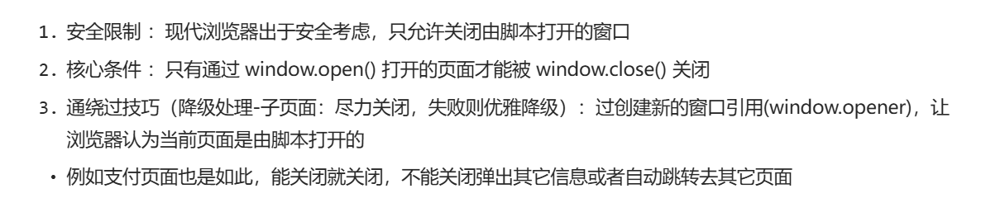

# 1. 功能列表

1. video.js 插件使用
2. 语音播放:

- "video.js": "^8.10.0",

3. 代码编辑器：展示、写代码、字符/唤起弹框

```js
    "file-loader": "^6.2.0",
    "react-ace": "^11.0.1",
    "react-ace-builds": " ^7.4.1",
```

4. 视频帧预览
5. 浏览器标签页通信

- react-redux 是不能够跨标签通信
- BroadcastChannel、localStorage 实现通信
- FormStorage：封装 BroadcastChannel、localStorage，自动兼容降级。

6. requestAnimationFrame 优化长列表

7. 关闭浏览器标签
   

8. 网页复制成图片到剪切板技术
